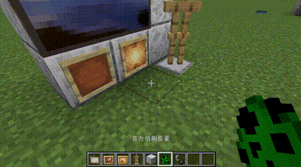

# Hold back, Creeper!
A Simple Bukkit/Spigot Plugin to prevent Creeper from damaging **blocks/entities**.

  

## Install

1. Download the plugin [here](https://github.com/Bottle-M/HoldBackCreeper/releases/latest).  

2. Put the plugin jar file into the `plugins` folder of your server, and restart the server.

3. Have a cup of tea ☕ and wait for the server to start~  

## Configs

A config file named `config.yml` will be generated in the `plugin/HoldBackCreeper` folder the first time your server starts:   

```yaml
# Enable the plugin
enable: true
# Worlds where the damage of creeper explosions will be ignored
# worlds:
#  - world
#  - world_nether
#  - world_the_end
worlds: [ ]

# Entities that ignore the effects of the CREEPER explosions
# Reference: https://hub.spigotmc.org/javadocs/bukkit/org/bukkit/entity/EntityType.html
entities:
  - PAINTING
  - ARMOR_STAND
  - LEASH_HITCH
  - ITEM_FRAME
  - GLOW_ITEM_FRAME
```

I've made detailed comments in the config file.  

However, it's worth noticing that the config field '`entities`' will be applied to all worlds listed in '`worlds`'.  

You can refer to the [Minecraft Wiki-Entity](https://minecraft.fandom.com/wiki/Entity) for more information about the entity types.  

## Commands

There is only one command in this plugin:

```bash
/holdbackcreeper reload
```

for **reloading** the config file.  

### Command Permission

```bash
holdbackcreeper.reload
```

> 💡 **Operators** will have this permission by default.  

### Effect

  

## License

Under [MIT License](./LICENSE).

Thank you for using the plugin.